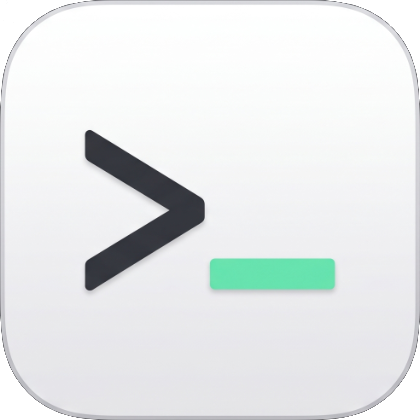
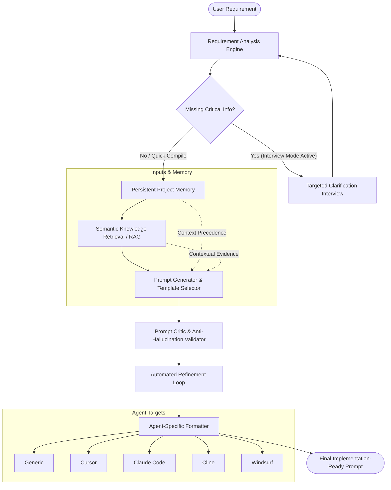
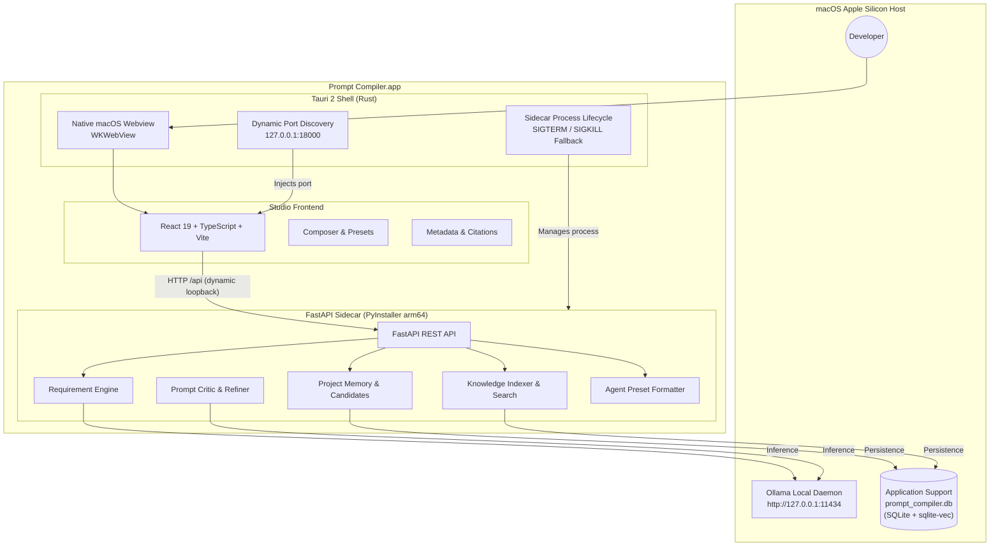

<div align="center">



# Prompt Compiler

**A local-first macOS desktop application that compiles rough, unstructured human requirements into clear, validated, implementation-ready prompts for AI coding agents.**

<br/>

<a href="https://github.com/bhavyaku11/Prompt-Compiler/releases/download/v0.1.1/Prompt.Compiler_0.1.1_aarch64.dmg">
  
</a>

<p>
  <b>Direct 1-Click Download:</b> <a href="https://github.com/bhavyaku11/Prompt-Compiler/releases/download/v0.1.1/Prompt.Compiler_0.1.1_aarch64.dmg"><b>Prompt.Compiler_0.1.1_aarch64.dmg</b></a><br/>
  <sub>Compatible with macOS 14+ on Apple Silicon (M1/M2/M3/M4) &bull; Requires local <a href="https://ollama.com/">Ollama</a></sub>
</p>

[](https://github.com/bhavyaku11/Prompt-Compiler/releases/tag/v0.1.1)
[](https://github.com/bhavyaku11/Prompt-Compiler/releases/download/v0.1.1/Prompt.Compiler_0.1.1_aarch64.dmg)
[-black.svg)](#system-requirements)
[](#technology-stack)
[](#technology-stack)
[-FFC131.svg)](#architecture)
[-white.svg)](#local-ai-inference-with-ollama)
[](#data-storage--privacy)

</div>

---

## Overview

AI coding agents (such as **Cursor Composer**, **Claude Code**, **Cline**, and **Windsurf Cascade**) perform best when provided with structured specifications: explicit technical boundaries, confirmed project stacks, architectural constraints, and step-by-step execution guidelines. However, developers and vibe coders naturally write short, ambiguous instructions.

When agents guess missing details, they introduce hallucinated libraries, break existing patterns, and require endless rounds of iterative debugging.

**Prompt Compiler** bridges this gap. It acts as an optimizing compiler for developer intent:
- Parses unstructured natural language into structured technical specifications.
- Injects persistent project context and retrieved codebase knowledge.
- Detects ambiguities and suppresses model hallucinations using an automated critic loop.
- Formats the resulting prompt specifically for your chosen target AI agent.
- Runs **100% locally** using Ollama—no cloud AI APIs or proprietary subscriptions required for compilation.

---

## Compilation Workflow

Prompt Compiler enforces a deterministic, multi-stage pipeline where human intent is systematically refined:



---

## Desktop Architecture

Prompt Compiler combines a lightweight **Tauri 2** native desktop shell, a modern **React 19** Studio interface, an autonomous **FastAPI** sidecar executable, and a local **Ollama** engine:



---

## Target Agent Presets

Prompt Compiler preserves underlying requirement semantics while adapting prompt layout, section hierarchy, and rule prominence for specific developer agents:

| Preset | Target Environment | Structure & Optimization |
| :--- | :--- | :--- |
| **`generic`** | Any LLM / Web Chat | Balanced canonical Markdown with Objectives, Requirements, Implementation Steps, and Constraints. |
| **`cursor`** | Cursor Composer / Chat | Compact layout placing `# Context` at the top, followed by `# Objective`, `# Requirements`, and `# Rules & Constraints`. |
| **`claude_code`** | Claude Code CLI | Command-oriented layout with explicit role definition, task breakdown, terminal-friendly execution steps, and verification commands. |
| **`cline`** | Cline / Roo Code | Specification-heavy structure emphasizing architectural boundaries, strict constraints, and step-by-step checkboxes. |
| **`windsurf`** | Windsurf Cascade | Action-oriented layout prioritizing context anchoring, incremental implementation plans, and verification checkpoints. |

---

## Core Features & Capabilities

### 1. Structured Requirement Analysis
- Extracts intent, domain, confirmed requirements, constraints, safe defaults, and explicit unknowns.
- **Zero Hallucination Principle**: Unknowns remain explicitly flagged. Missing information is never silently fabricated.

### 2. Long-Term Project Memory
- Maintains persistent facts about your project (stack, coding conventions, architectural decisions).
- **Precedence Hierarchy**: Current User Input > Confirmed Project Memory > Retrieved Knowledge > System Defaults > Assumptions.
- **Read-Only Compilation Invariant**: Compiling prompts never mutates project memory without user consent.

### 3. Candidate Memory Extraction & Confirmation
- Automatically identifies project decisions mentioned during conversations.
- Proposes them as candidate memories with confidence scoring and conflict detection.
- Requires explicit user approval (`POST .../approve`) before permanent storage.

### 4. Local Vector Knowledge Base (RAG)
- Ingests project files (`.py`, `.ts`, `.md`, `.txt`, `.json`) directly from your local filesystem.
- Vector embeddings stored locally via `sqlite-vec` with 768-dimensional cosine distance KNN search.
- Multi-query synthesis generates up to 3 targeted retrieval queries per prompt with zero extra LLM calls.
- Strict project isolation: queries for Project A will never retrieve chunks from Project B.

### 5. Interactive Interview Mode
- Opt-in multi-turn clarification workflow for complex or underspecified requests.
- Asks targeted, multiple-choice or short-answer questions when critical technical details are missing.
- Compiles the final prompt once ambiguity is resolved.

### 6. Local-First Security & Data Ownership
- Core compilation pipeline runs 100% locally.
- Server-side user ownership isolation: resources are strictly scoped to the authenticated user.
- Anti-probing boundaries: unauthorized access returns HTTP `404 Not Found` (never `403 Forbidden`).
- Production bundles contain zero embedded secret keys; authentication relies on offline RSA public key validation.

---

## System Requirements

- **Operating System**: macOS Sonoma 14+ or macOS Sequoia 15+
- **Architecture**: Apple Silicon (`arm64` — M1, M2, M3, M4)
- **External Dependency**: [Ollama](https://ollama.com/) installed and running locally
- **Disk Space**: ~250 MB for the application bundle + space for local Ollama models

---

## Download

### macOS — Apple Silicon (`arm64`)

[-2ea44f?style=for-the-badge&logo=apple&logoColor=white)](https://github.com/bhavyaku11/Prompt-Compiler/releases/download/v0.1.1/Prompt.Compiler_0.1.1_aarch64.dmg)

| Package | Target Architecture | Direct Download Link |
| :--- | :--- | :--- |
| **Prompt Compiler DMG** | Apple Silicon (`arm64` — M1/M2/M3/M4) | [**Prompt.Compiler_0.1.1_aarch64.dmg**](https://github.com/bhavyaku11/Prompt-Compiler/releases/download/v0.1.1/Prompt.Compiler_0.1.1_aarch64.dmg) |

*Direct release page*: [GitHub Release v0.1.1](https://github.com/bhavyaku11/Prompt-Compiler/releases/tag/v0.1.1)

---

## Installation & Setup

### Option A: End Users (Desktop DMG)

1. **Install and Start Ollama**:
   Download Ollama from [ollama.com](https://ollama.com/) and pull the default desktop model:
   ```bash
   ollama pull qwen3:0.6b
   ```
2. **Download Prompt Compiler**:
   Click the direct link above or download [Prompt.Compiler_0.1.1_aarch64.dmg](https://github.com/bhavyaku11/Prompt-Compiler/releases/download/v0.1.1/Prompt.Compiler_0.1.1_aarch64.dmg) from the [Releases](https://github.com/bhavyaku11/Prompt-Compiler/releases/tag/v0.1.1) page.
3. **Install**:
   Open the DMG file and drag **Prompt Compiler** into your `Applications` folder.
4. **Launch**:
   - Open `/Applications/Prompt Compiler.app`.
   - *Note on Gatekeeper*: Because release candidate builds are ad-hoc signed (`Signature=adhoc`), macOS may prompt that the developer cannot be verified on first double-click. Right-click the app in Finder and select **Open**, or allow it via **System Settings > Privacy & Security**.

---

### Option B: Developers (Run from Source)

#### Prerequisites
- Node.js 20+ and npm 10+
- Python 3.12+ (Python 3.14 recommended)
- Rust 1.80+ (`rustup toolchain install stable`)
- Local Ollama daemon running on `http://127.0.0.1:11434`

#### 1. Clone the Repository
```bash
git clone https://github.com/bhavyaku11/Prompt-Compiler.git
cd Prompt-Compiler
```

#### 2. Backend Setup
```bash
cd backend
python3 -m venv .venv
source .venv/bin/activate
pip install -r requirements.txt
cp .env.example .env

# Start FastAPI development server
uvicorn app.main:app --host 127.0.0.1 --port 8000 --reload
```

#### 3. Frontend Setup
In a new terminal window:
```bash
cd frontend
npm install
cp .env.example .env.local

# Start Vite development server
npm run dev
```
Visit `http://localhost:5173` in your browser.

#### 4. Run the Full Tauri Desktop App
```bash
# In the repository root
npm install
npm run tauri dev
```

---

## Local AI Inference with Ollama

Prompt Compiler uses Ollama for local generation and embedding inference.

```bash
# Recommended default (fast compilation in 7–12 seconds on Apple Silicon)
ollama pull qwen3:0.6b

# Optional high-reasoning model (deep technical analysis)
ollama pull qwen3:4b

# Optional local vector embedding model for knowledge base RAG
ollama pull nomic-embed-text
```

The application detects Ollama availability via a non-blocking health check against `GET http://127.0.0.1:11434/api/tags`. It will never automatically initiate large model weight downloads without explicit action.

---

## Building Release Artifacts

To compile the standalone backend binary, native `.app` bundle, and production `.dmg` installer:

```bash
# 1. Build Standalone Python Backend Sidecar (PyInstaller arm64)
python3 scripts/build_backend.py

# 2. Build Production macOS .app Bundle
npx tauri build --bundles app

# 3. Build Production macOS .dmg Installer
npx tauri build --bundles dmg
```

Output artifacts will be generated in:
- `src-tauri/target/release/bundle/macos/Prompt Compiler.app` (44.86 MiB)
- `src-tauri/target/release/bundle/dmg/Prompt Compiler_0.1.0_aarch64.dmg` (35.15 MiB)

---

## Data Storage & Privacy

Prompt Compiler adheres strictly to a local-first privacy model:

- **Local Persistence**: All compiled prompts, interview sessions, requirement analyses, project memories, and vector embeddings are stored in a local SQLite database at:
  ```text
  ~/Library/Application Support/com.promptcompiler.app/prompt_compiler.db
  ```
- **Loopback Binding**: The FastAPI sidecar binds exclusively to loopback (`127.0.0.1`) on a dynamic port (`18000`+) and does not open external network interfaces.
- **Authentication**: User accounts are authenticated via Clerk. Authentication tokens are verified offline on the local sidecar using an embedded RSA public key. No project source code or prompt data is transmitted to third-party model providers.

---

## Project Structure

```text
Prompt-Compiler/
├── backend/                        # FastAPI local sidecar application
│   ├── app/
│   │   ├── ai/                     # Ollama API client & embedding provider
│   │   ├── api/                    # REST endpoints (compile, projects, knowledge, interview)
│   │   ├── benchmark/              # Deterministic regression benchmark suite
│   │   ├── database/               # SQLAlchemy ORM models & repositories
│   │   ├── engine/                 # Requirements, memory, RAG, critic & refiner
│   │   ├── schemas/                # Pydantic v2 data models
│   │   ├── templates/              # Task templates & agent preset formatters
│   │   ├── config.py               # Central application settings
│   │   ├── desktop_entry.py        # Production sidecar entry point
│   │   └── main.py                 # FastAPI application factory
│   ├── tests/                      # Automated backend unit & integration tests (396 tests)
│   ├── PromptCompilerBackend.spec  # PyInstaller standalone packaging specification
│   └── requirements.txt            # Python dependencies
├── frontend/                       # React 19 / TypeScript / Vite Studio UI
│   ├── src/
│   │   ├── api/                    # Typed API client & Tauri IPC bridge
│   │   ├── components/studio/      # Composer, PromptCard, MetadataAccordion, Sidebar
│   │   ├── views/                  # StudioView, LandingView, AuthView
│   │   └── index.css               # Tailwind CSS v4 styling & animations
│   ├── tests/                      # Frontend bridge & auth client tests
│   └── vite.config.ts              # Vite configuration with API reverse proxy
├── src-tauri/                      # Tauri 2 native desktop application shell
│   ├── binaries/                   # Tauri external sidecar executable directory
│   ├── capabilities/               # Desktop security capabilities
│   ├── src/
│   │   ├── lib.rs                  # Sidecar lifecycle management & port negotiation
│   │   └── main.rs                 # Tauri application entry point
│   └── tauri.conf.json             # Desktop bundle & window configuration
├── docs/                           # Architecture specifications, PRD, and audit reports
├── scripts/                        # Build & packaging automation scripts
├── CONTRIBUTING.md                 # Contribution guidelines
├── SECURITY.md                     # Security policy & disclosure instructions
└── README.md                       # Product documentation
```

---

## Verification & Quality Assurance

Prompt Compiler v0.1.0 Release Candidate has undergone rigorous automated testing and auditing:

- **Backend Test Suite**: 396 / 396 passed (100%) in `pytest backend/tests`
- **Frontend Quality**: 0 errors, 0 warnings across 43 source files via `npx oxlint`
- **Frontend Tests**: 7 / 7 automated bridge and authentication tests passed
- **Type Safety**: Clean compilation with TypeScript (`tsc -b`)
- **Audit Verification**: 43 / 43 items in [docs/19-release-checklist.md](docs/19-release-checklist.md) verified PASS (100%)
- **Zero Embedded Secrets**: Comprehensive binary inspection confirmed 0 secret keys or private certificates in release artifacts.

---

## Known Limitations

- **Ad-hoc Signing**: Release candidate binaries are ad-hoc signed (`Signature=adhoc`). macOS Gatekeeper requires a one-time user authorization on initial launch.
- **Platform Support**: Built natively for Apple Silicon (`arm64`). Intel (`x86_64`) Macs require Rosetta 2 translation.
- **Ollama Dependency**: Ollama is an external local service and must be running on the host machine.
- **Embedding Model**: Real vector indexing requires `ollama pull nomic-embed-text`. If missing, compilation degrades gracefully with clear status telemetry.

---

## Roadmap & Project Status

The Prompt Compiler project has completed all 36 defined tasks in the product roadmap. The current release is:

**`v0.1.0`**

All foundational features across Phase 1 (Core Compiler), Phase 2 (Memory & RAG), and Phase 3 (Desktop Packaging & Release Verification) are complete and validated. Future work is focused on community feedback, maintenance, and platform expansions.

---

## License

All licensing and distribution rights are reserved for the project owner. See repository details for updates.
